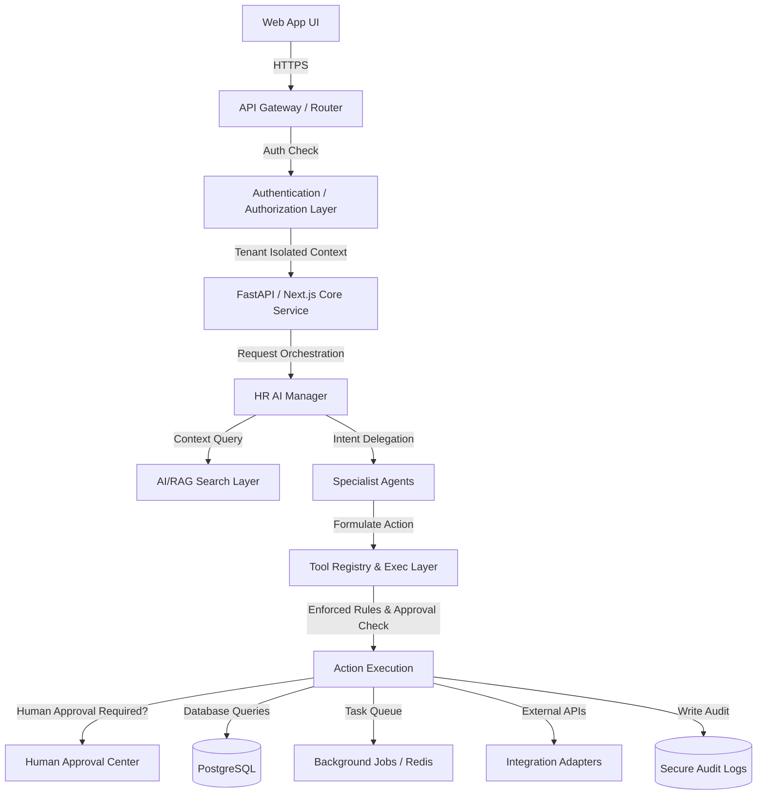
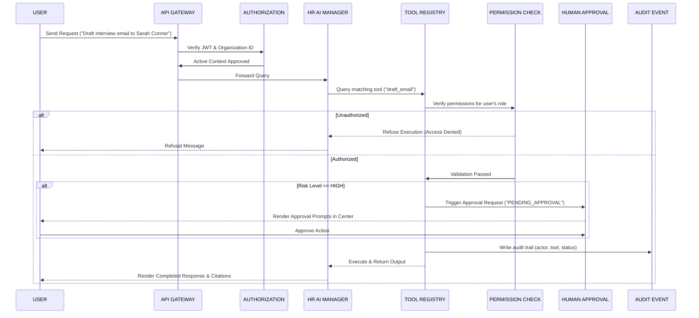

# HRFlow AI — Technical Architecture

This document details the system design, logical layout, components, and data flow of the HRFlow AI platform.

## 1. System Topology



---

## 2. Core Service Layers

The platform is structured into ten distinct logical layers to ensure strict separation of concerns, multi-tenancy, and security bounds:

1. **Presentation Layer**: React / Next.js web interface featuring the Client Dashboard, AI Conversation Workspace, and Onboarding wizard.
2. **API Layer**: REST endpoints that map client requests to backend handlers.
3. **Authentication & Authorization Layer**: Validates JWT sessions and enforces Role-Based Access Control (RBAC) scopes.
4. **Agent Orchestration Layer**: The `HR AI Manager` handles intent parsing, task decomposition, agent routing, and validation.
5. **Tool Execution Layer**: The registry containing all safe, permissioned actions (e.g. `search_company_knowledge`, `draft_email`).
6. **Business Logic Layer**: Non-AI transactional rules governing requests, onboarding flows, and employee directory management.
7. **AI/RAG Layer**: Context retrieval engine using tenant-isolated semantic search.
8. **Data Access Layer**: PostgreSQL interface, isolating data strictly using `organization_id`.
9. **Integration Layer**: Adapter interfaces for third-party systems (Google Workplace, Microsoft 365, etc.).
10. **Audit & Observability Layer**: Structured logs detailing every authentication, database read/write, tool call, and security event.

---

## 3. The Trusted AI Workflow

To defend against GenAI hazards such as **unrestricted tool execution** and **excessive agency**, all agent actions flow through this structured funnel:



---

## 4. Agent-to-Agent Communication Protocol

Agents communicate using structured message schemas rather than raw, uncontrolled text. This prevents cascading loops and keeps activities verifiable. The message contract is:

```typescript
interface AgentMessage {
  id: string;              // Unique message UUID
  correlationId: string;   // Maps to the parent User Request ID
  sender: string;          // E.g., 'HR AI Manager'
  recipient: string;       // E.g., 'Policy & Knowledge Agent'
  messageType: 'request' | 'response' | 'thought' | 'error';
  content: string;         // Plain-text instructions or results
  payload: Record<string, any>; // Structured input/output arguments
  timestamp: string;       // ISO 8601
}
```

---

## 5. Failure & Reliability Engineering

- **Retry Strategy**: Non-state-modifying operations (such as vector database lookups) employ exponential backoff. State-modifying operations (such as sending mail) require an idempotency key to prevent duplication.
- **Timeout Strategy**:
  - LLM/Chat operations: 15 seconds timeout.
  - Policy Search: 5 seconds timeout.
  - Integrations: 10 seconds timeout.
- **Observability Strategy**: Logs are structured in JSON formatting and trace requests end-to-end using a `correlation_id` across the HTTP headers, agent run records, and database audits.
